<!-- Generated by `npm run readme` from src/readme/template.ts. Edit data/config.json, not this file. -->

<picture><source media="(prefers-color-scheme: dark) and (max-width: 600px)" srcset="assets/hero-mobile-dark.svg"><source media="(prefers-color-scheme: light) and (max-width: 600px)" srcset="assets/hero-mobile-light.svg"><source media="(prefers-color-scheme: dark)" srcset="assets/hero-dark.svg"><source media="(prefers-color-scheme: light)" srcset="assets/hero-light.svg"></picture>

<picture><source media="(prefers-color-scheme: dark) and (max-width: 600px)" srcset="assets/stats-mobile-dark.svg"><source media="(prefers-color-scheme: light) and (max-width: 600px)" srcset="assets/stats-mobile-light.svg"><source media="(prefers-color-scheme: dark)" srcset="assets/stats-dark.svg"><source media="(prefers-color-scheme: light)" srcset="assets/stats-light.svg"></picture>
&nbsp;&nbsp;
<picture><source media="(prefers-color-scheme: dark) and (max-width: 600px)" srcset="assets/languages-mobile-dark.svg"><source media="(prefers-color-scheme: light) and (max-width: 600px)" srcset="assets/languages-mobile-light.svg"><source media="(prefers-color-scheme: dark)" srcset="assets/languages-dark.svg"><source media="(prefers-color-scheme: light)" srcset="assets/languages-light.svg"></picture>

<a href="https://github.com/AndrewKochulab/jarvis-dashboard"><picture><source media="(prefers-color-scheme: dark) and (max-width: 600px)" srcset="assets/project-jarvis-dashboard-mobile-dark.svg"><source media="(prefers-color-scheme: light) and (max-width: 600px)" srcset="assets/project-jarvis-dashboard-mobile-light.svg"><source media="(prefers-color-scheme: dark)" srcset="assets/project-jarvis-dashboard-dark.svg"><source media="(prefers-color-scheme: light)" srcset="assets/project-jarvis-dashboard-light.svg"></picture></a>
&nbsp;&nbsp;
<a href="https://github.com/AndrewKochulab/react-native-swiftui-dsl"><picture><source media="(prefers-color-scheme: dark) and (max-width: 600px)" srcset="assets/project-react-native-swiftui-dsl-mobile-dark.svg"><source media="(prefers-color-scheme: light) and (max-width: 600px)" srcset="assets/project-react-native-swiftui-dsl-mobile-light.svg"><source media="(prefers-color-scheme: dark)" srcset="assets/project-react-native-swiftui-dsl-dark.svg"><source media="(prefers-color-scheme: light)" srcset="assets/project-react-native-swiftui-dsl-light.svg"></picture></a>

<a href="https://github.com/AndrewKochulab/AnalyticsSystem"><picture><source media="(prefers-color-scheme: dark) and (max-width: 600px)" srcset="assets/project-analyticssystem-mobile-dark.svg"><source media="(prefers-color-scheme: light) and (max-width: 600px)" srcset="assets/project-analyticssystem-mobile-light.svg"><source media="(prefers-color-scheme: dark)" srcset="assets/project-analyticssystem-dark.svg"><source media="(prefers-color-scheme: light)" srcset="assets/project-analyticssystem-light.svg"></picture></a>
&nbsp;&nbsp;
<a href="https://github.com/AndrewKochulab/RealmStorage"><picture><source media="(prefers-color-scheme: dark) and (max-width: 600px)" srcset="assets/project-realmstorage-mobile-dark.svg"><source media="(prefers-color-scheme: light) and (max-width: 600px)" srcset="assets/project-realmstorage-mobile-light.svg"><source media="(prefers-color-scheme: dark)" srcset="assets/project-realmstorage-dark.svg"><source media="(prefers-color-scheme: light)" srcset="assets/project-realmstorage-light.svg"></picture></a>

<picture><source media="(max-width: 600px)" srcset="assets/blank.svg"><source media="(prefers-color-scheme: dark)" srcset="assets/contributions-dark.svg"><source media="(prefers-color-scheme: light)" srcset="assets/contributions-light.svg"></picture>

<a href="https://www.instagram.com/andrewkochulab"><picture><source media="(prefers-color-scheme: dark)" srcset="assets/contact-instagram-dark.svg"><source media="(prefers-color-scheme: light)" srcset="assets/contact-instagram-light.svg"></picture></a>
<a href="https://www.linkedin.com/in/andrewkochulab"><picture><source media="(prefers-color-scheme: dark)" srcset="assets/contact-linkedin-dark.svg"><source media="(prefers-color-scheme: light)" srcset="assets/contact-linkedin-light.svg"></picture></a>

